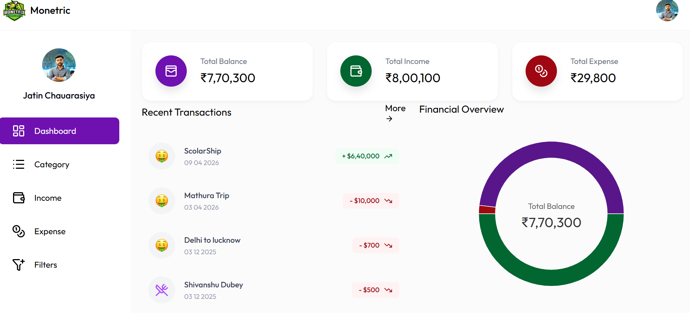
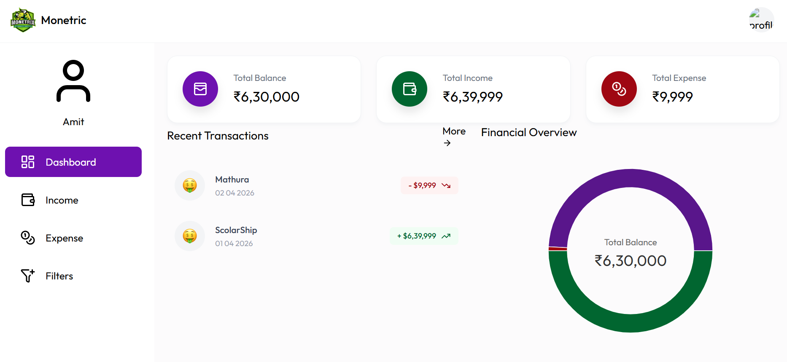
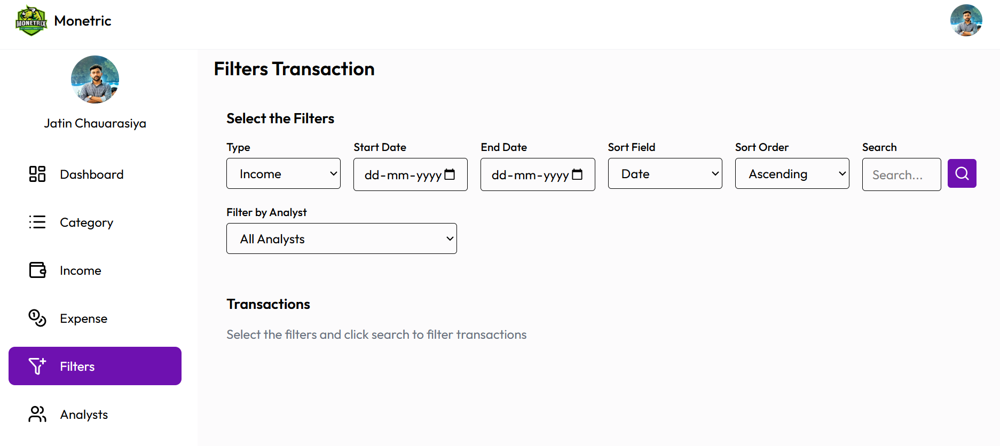

# 💰 FinanceControl (Monetric)

A full-stack financial management system to track income, expenses, and analytics with role-based access.

---

## 🚀 Tech Stack

### 🖥️ Backend
- Spring Boot (Java)
- Spring Security + JWT Authentication
- MySQL Database
- Cloudinary (Image Upload)

### 🎨 Frontend
- React.js
- Tailwind CSS
- Bootstrap

---

## 🔗 API Documentation

- Postman Collection:  
  https://www.postman.com/jatinchaurasiya/financecontrol-api/request/45012710-71993ce7-8adb-4d30-9d6d-f461dc4669c2?sideView=agentMode

---

## 👤 Default Admin Credentials

- Email: **admin@gmail.com**
- Password: **admin123**

---

### 👥 User Roles

The system supports two roles with different permissions:

🔑 Admin (Analyst Role)

- Full system access
- Manage all users (ban / unban analysts)
- Add / update categories
- Add income & expense for any analyst
- Delete income & expense
- View all transactions
- Access dashboard & analytics
- Apply advanced filters

👤 Analyst / User
- Limited access
- View personal dashboard
- Add income
- Add expense
- Filter own transactions

---

## ✨ Features

### 🔑 Admin (Analyst Role)

- Dashboard (Total Balance, Income, Expense)
- Add / Update Categories
- Add Income for any Analyst
- Add Expense for any Analyst
- Delete Income & Expense
- Track all transactions
- Advanced Filters (date, type, analyst, sorting)
- Ban / Unban Analysts
- Analytics Dashboard

📸 **Admin Dashboard**  



---

### 👤 Analyst / User

- View personal dashboard
- Add Income
- Add Expense
- Filter transactions

📸 **User Dashboard**  




---

### 🔍 Filters

- Filter by Type (Income / Expense)
- Date Range filter
- Sort (Date, Amount)
- Filter by Analyst

📸 **Filters**  



---

## ⚙️ Project Setup

### 📥 Clone Repository

```bash
git clone https://github.com/Jatin-chaurasiya/FinanceControl.git
cd FinanceControl
````
## 🔧 Backend Setup (Spring Boot)

### ➤ Step 1: Navigate to backend
```bash
cd backend
```
## ➤ Step 2: Configure properties
```bash
Copy file:
application.properties.example → application.properties
Update required fields:
spring.datasource.username=your_db_username
spring.datasource.password=your_db_password
jwt.secret=your_secret_key
```
### ➤ Step 3: Run Backend
```bash
mvn spring-boot:run

OR run MoneymanagerApplication.java from IDE
```
### 💻 Frontend Setup

### ➤ Step 1: Navigate to frontend
```bash
cd frontend
```
###b ➤ Step 2: Install dependencies
```bash
npm install
```
### ➤ Step 3: Run project
```bash
npm run dev
```
### 🗄️ Database Setup
```bash
CREATE DATABASE moneymanager;
Tables will be auto-created using Hibernate
```
---

### ⚡ Quick Setup (For Reviewer)

Only update:

Database username & password
JWT secret (any random string)

Optional (can skip):

Mail configuration
Google OAuth
Cloudinary

---
### ⚠️ Important Notes

- Backend is not deployed (free-tier limitation)
- Project runs locally
- APIs tested via Postman

---
### 🚀 Future Improvements

- Deploy backend (Docker + Cloud)
- Add activity logs
- Pagination & analytics
- Improve UI/UX
